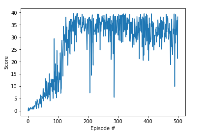

## Learning Algorithm
Udacity's code/implementation example of Deep Deterministic Policy Gradient (DDPG) algorithm was easy to follow and thus, I have used the algorithm for this project.

Deep Deterministic Policy Gradient (DDPG) is an algorithm which concurrently learns a Q-function and a policy. It uses off-policy data and the Bellman equation to learn the Q-function, and uses the Q-function to learn the policy.
[Source](https://spinningup.openai.com/en/latest/algorithms/ddpg.html)

A good explanation with code can be found [here](https://towardsdatascience.com/deep-deterministic-policy-gradients-explained-2d94655a9b7b).

Some characteristics of DDPG:

- DDPG is an off-policy algorithm.
- DDPG can only be used for environments with continuous action spaces.
- DDPG can be thought of as being deep Q-learning for continuous action spaces.

Hyperparameters used:

- BUFFER_SIZE = int(1e5)  # replay buffer size
- BATCH_SIZE = 128        # minibatch size
- GAMMA = 0.99            # discount factor
- TAU = 1e-3              # for soft update of target parameters
- LR_ACTOR = 2e-4         # learning rate of the actor 
- LR_CRITIC = 2e-4        # learning rate of the critic
- WEIGHT_DECAY = 0        # L2 weight decay

Model architecture:
I used Udacity's example code on DDPG. I experimented very little with the number of hidden layers and neurons as my training was taking too long and the average score was not improving (less than 1). I experimented mostly with hyperparameters. The architecture uses 2 fully connected actor critic neural networks.

## Plot of Rewards
I couldn't get 20 agents working, so I used 1 agent and ran for 500 episodes.

## Ideas for Future Work
- Training with 20 or multiple agents
- Training using other algorithms like PPO, A3C, and D4PG that use multiple (non-interacting, parallel) copies of the same agent to distribute the task of gathering experience.
- Tweaking the buffer size (increase)
- Adding more timesteps for each episodes
- Run more episodes
